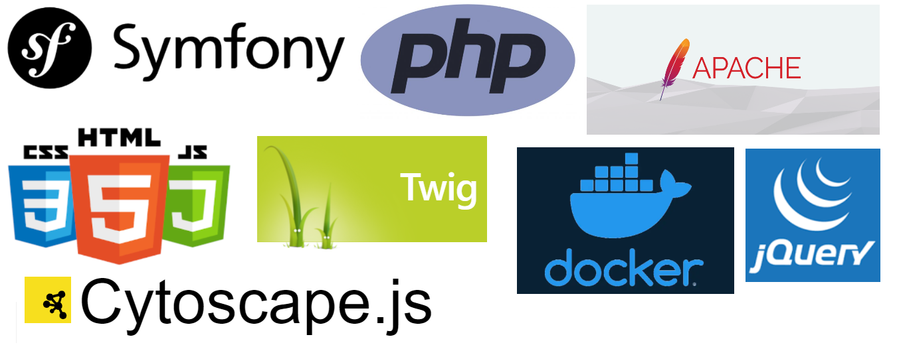
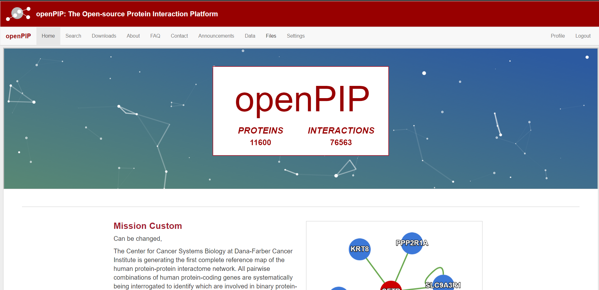
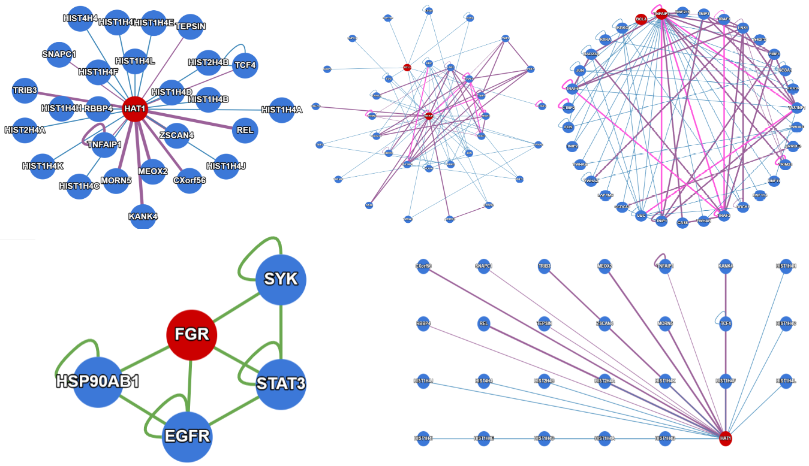

   

## GSoC '21 Report | Aniket Ranjan | @NRNB | Enhancement of OpenSource_Protein_Interaction_Platform

### Introduction 
The Google summer of code program has been a great and fun learning experience to me over the past months. The project was aimed to enhance the project of openPIP (OpenSource_Protein_Interaction_Platform) to make it production ready.

---

### What is OpenPIP
OpenPIP (Open Source Protein Interaction Platform) is a web application which can be used to visualize, modify, analyze and download thousands of complex protein-protein interactions for analysis, prediction and further research work.
The protein interaction data is fed into the platfrom using .psi file format which contains information about the protein interactions and further annotations.
The webapplication gets the uniprot/ensemble ID from the .psi file and fetches the protein data like protein_name, gene_name, protein_sequence, description, external_links and saves them to the database.
The protein interactions are then visualized using Cytoscape.js library. The application supports search filters which can be used to enrich and filter desired results which can be saved for further analysis.

#### Protein Interaction data file

  
#### OpenPIP webapp

  
#### Protein_Interaction Visualization using CytoscapeJS

 
---

  
### Work Summary and Pull requests

 *<a href="https://github.com/BaderLab/openPIP/pull/76">https://github.com/BaderLab/openPIP/pull/76</a>*
   
 <u> The following features are integrated with this pull request: </u>

- [x] Inclusion of vendor files in this Symfony project.
- [x] Fixed double headers in data, files, and announcement section.
- [x] Fixed navigation bar in data section.
- [x] Main title made dynamic which can be changed via admin settings.
- [x] Fixed bug in the search filter.
- [x] Mission and Method section in the 'home page' made dynamic to be changed via admin settings.
- [x] Home page heading changed to the dynamic short title.
- [x] File section: recreated the complete section with the following features.
     - server-side creation and deletion of folder.
     - uploading of any file format in any folder of choice.
     - download, delete and copy path button for each file inside the folder.
     - dropzone section to upload files via drop or click.
     - supports multiple file uploads at once.
     - file upload with progress bar, remove and cancel options.
     - mapping of all uploaded files to data section for protein upload.
     - UI/UX ++
       
- [x] Data section: the following features were added.
     - Button to purge the database completely, including proteins, interactions, annotations, external links, etc.
     - Affirmation validation on clean database button.
     - Section for protein upload to the database via .psi format files natively.
     - Choice type form showing all uploaded files on the server for interaction upload selection.
     - Extention of upload to all file formats having `tab` separated entries.
     - Added validation before file upload, validating upload with file type, double affirmation, and estimated time.
     - Added protein and interaction count in upload validation.
     - Added countdown timer with the estimated time when protein and interactions are being uploaded.
     - `Estimated time` for the countdown timer made dynamic to each file selected for upload.
     - Added cards showing proteins and interactions present in the database.
     - Section to view gene names uploaded and direct link to visit the search bar with the selected gene name.
     - UI/UX ++

- [x] Packaged the opepPIP application in docker-compose file:
     - web application is packaged with containerized MySQL8.0 database.
     - application is served using containerized php:7.2.0-apache server.
     - docker-compose file having all the dependencies and interconnections for application.
     - Single command to start the application: `docker-compose up`.
      
- [x] General bug fixes, code cleanup and refactoring. 
- [x] Documentation, readme and installation guide.
- [x] Integration of interaction and protein annotation during upload.

 
---
 
### Future Scope
 
- Optimization of data upload for faster insertion in database. Currently it takes 1.5 seconds for insertion of each protein.
- Integration of Interaction category, annotations during data upload.
- Optimizing upload for ensemble and entrez id.
- Integration of Datasets handle and download.
- Integration of complex, domain, isoform if when needed.
- User optimization and registration. Mapping user with proteins uploaded. 
- Upgrading of symfony framework to laset release, since new features can't be installed in unmaintained old version.
 

---

### Important Links

* [OpenPIP live portal Baderlabs](http://openpip.baderlab.org/)
* [OpenPIP github repo](https://github.com/BaderLab/openPIP)
* [GitHub Aniket Ranjan](https://github.com/aniket328)
* [GSoC Project Link](https://summerofcode.withgoogle.com/projects/#4645790724653056)
* [NRNB](https://nrnb.org/)

---

### Contact

* Email: ranjan.aniket20013@gmail.com
* [GSoC Project Link](https://summerofcode.withgoogle.com/projects/#4645790724653056)

<a href="https://www.linkedin.com/in/aniket328" rel="nofollow noreferrer">
   LinkedIn
</a> &nbsp; 
<a href="https://github.com/aniket328" rel="nofollow noreferrer">
   Github
</a>

